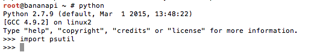

# bedugqueue
Linux Monitoring System Tool Using psutils for Stress test

## Pre Instalation


1. install pip
2. install psutil from pip
3. download and run bedugqueue

on Centos 6 & 7

```sh
# rpm -iUvh http://dl.fedoraproject.org/pub/epel/7/x86_64/e/epel-release-7-5.noarch.rpm
# yum -y install python-pip
# pip install --upgrade pip
# yum  install python-devel.x86_64
# pip install psutil
```

on Debian 8

```sh
# apt-get install python-pip
# apt-get install python-dev  
# pip install --upgrade pip
# pip install psutil
```
Make sure no error, we can test using python CLI


## Reference
[top command]http://www.thegeekstuff.com/2009/10/how-to-capture-unix-top-command-output-to-a-file-in-readable-format/

[nload]http://technicalworldforyou.blogspot.co.id/2013/07/nload-monitor-your-internet-speed-in.html

[metriks]http://www.admin-magazine.com/HPC/Articles/Processor-and-Memory-Metrics